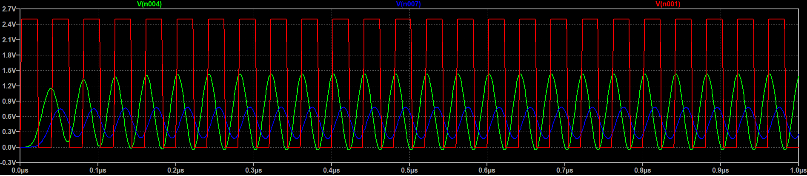

# SPICE Simulations

Folder containing LTSpice schematics

## Timing calibration LP filter

File: `cheb_7ord.asc`

A high precision (+- 500 ppb) 25 MHz 3V3 LVCMOS (AST3TQ-25.000MHZ-5) TCXO is used for the calibration source. It's make compatible with the DRS4 dynamic range and also shaped using a 7th order Chebyshev LP filter resulting in a roughly 430 mVpp sinewave.

